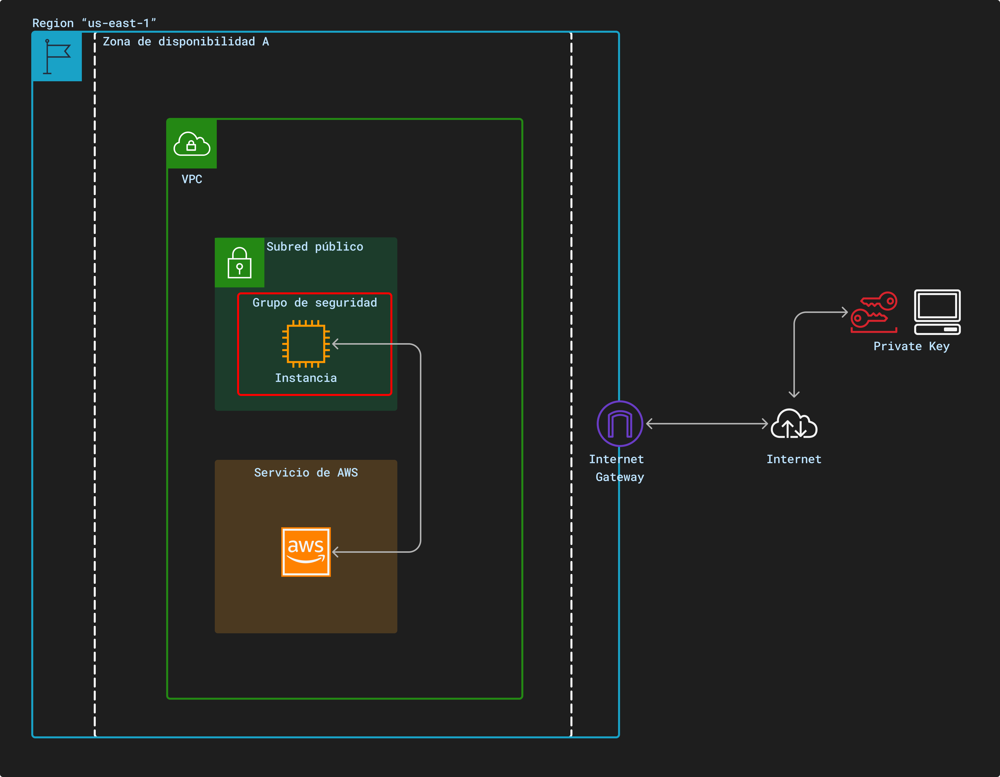
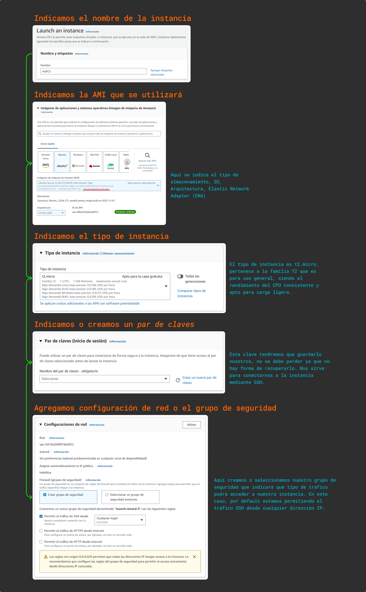
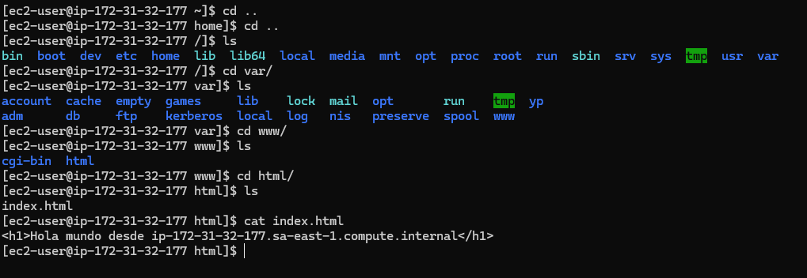

# Amazon Elastic Compute  Cloud (Amazon EC2)

Este servicio nos permite ejecutar una máquina virtual (instancia) en la infraestructura de AWS. Nos da la opción de escoger las características de estas instancias, tal como el procesador, almacenamiento, redes, sistema operativo, entre otros. La capacidad computacional es escalable, pudiendo escalar verticalmente para tareas con mayor carga computacional y disminuir en caso contrario.

En la imagen de arriba, tenemos un [VPC](vpc.md), personal o default, en el que se tiene una [instancia](../definiciones/ami.md) en la subred pública (puede acceder a internet), además de estar cubierta por un [grupo de seguridad](../definiciones/grupo-seguridad.md). Las instancias EC2 pueden conectarse con otros servicios de AWS, como  EBS, RDS, etc.

Para poder utilizar EC2 desde una máquina local, tendremos que acceder mediante una clave privada ([pares de clave](../definiciones/par-clave.md)) que se descarga a la hora de crear la instancia, así podremos ingresar mediante SSH a nuestra instancia.

## Proceso para crear un EC2 en AWS

## Acceso a la instancia desde AWS-CLI

Para acceder a la instancia de forma remota podemos hacerlo con PuTTY, en caso de tener Windows o también por el mismo PowerShell. Creamos una instancia de prueba que será eliminado después.

Una vez seguido los pasos anteriores tendremos nuestro par clave, la clave privada lo habremos descargado y guardado con esa nos podemos autenticar en la instancia.

Si se inicia la sesión a la instancia desde SSH, podemos encontrar la archivo creado

>[!TIP]
Es posible que tenga problemas a la hora de ingresar a la instancia, seguir las siguientes instrucciones de este [repositorio](https://gist.github.com/jaskiratr/cfacb332bfdff2f63f535db7efb6df93).

