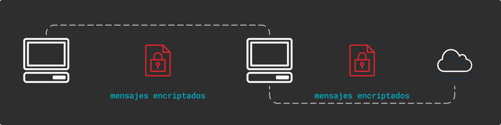

# Security Shell (SSH)

Este protocolo permite comunicar distintas computadoras o con servidores de forma remota, además de poder autentificar a los usuarios. Es posible transferir archivos y ejecutar comandos o programas.

||
|:--:|
|*Cifra toda comunicación entre cliente y servidor*|

 Lo genial de SSH es que en seguro aún en redes inseguras, es decir, si hay otros usuarios en la red, estos no pueden ver lo que se realiza por SSH.

 SSH permite la autentificación por varios métodos, entre estos está **usuario - contraseña** y **clave pública - clave privada**

 ## Autentificación por Clave pública - privada

 Se basa en un par de claves criptográficas asimétricas. El proceso es el siguiente:

 * **Generación de par de claves**: Se genera el par de claves mediante un algoritmo de generación, como RSA o ECDSA. Este par de claves consta de una pública y otra privada. La clave pública se comparte libremente y se utiliza para cifrar los datos, mientras que la clave privada se mantiene en secreto y se utiliza para descifrar los datos.
 * **Distribución de la clave pública**: Esta clave se distribuye a los servidores a los que el usuario desea acceder de forma segura. Esto se puede hacer copiando la clave pública al archivo `~/.ssh/authorized_keys` en el servidor remoto al que se quiere acceder.
 * **Solicitud de autentificación**: La solicitud que envía el cliente por SSH para conectarse al servidor remoto, es respondida por esta por un desafío criptográfico que debe ser respondida por una firma digital única.
 * **Firma del desafío**: El cliente utiliza su clave privada para firmar el desafío recibido por el servidor.
 * **Verificación de la firma**: El servidor utiliza la clave pública del cliente, que está almacenada en `~/.ssh/authorized_keys`, para verificar la firma recibida. Si la firma es válida y corresponde al desafío enviado previamente, el servidor autentica al cliente y permite el acceso.

> [!NOTE]
> Encriptación simétrica es cuando se utiliza una misma clave para cifrar y decifrar los mensajes, es más rápida de la asimétrica. Sin embargo, su principal problema es compartir estas llaves ya que un atacante podría verlo en una red no protegida.
> 
> Encriptación asimétrica es cuando se utiliza dos claves distintas, aquí viene el uso de la llave pública. No hay problema que un atacante vea la llave pública, ya que la validación se da por la privada que es la que no se comparte.
