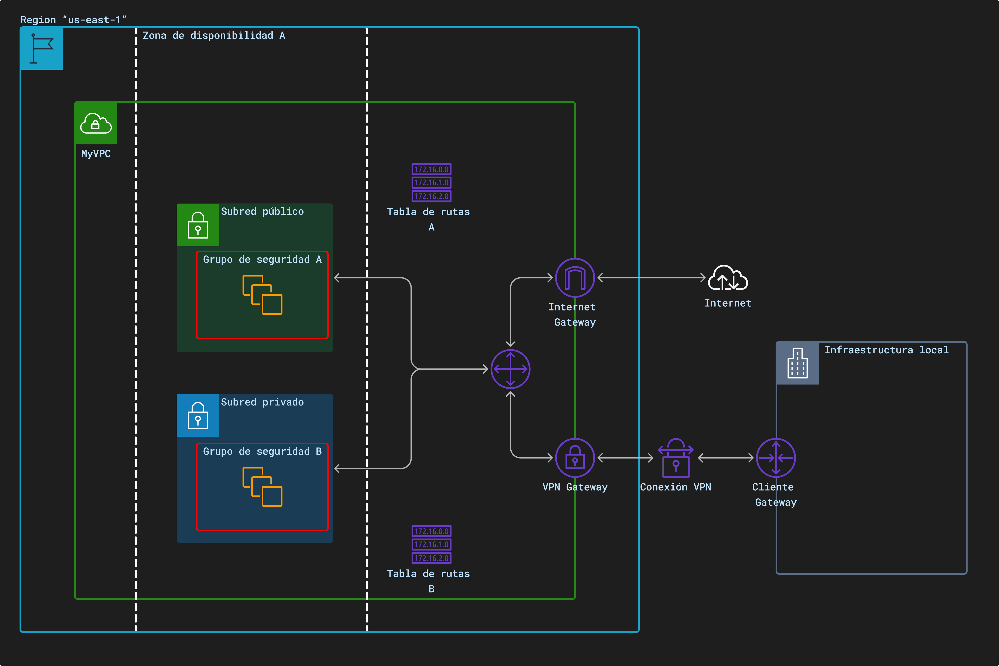

# Virtual Private Cloud (VPC)

Veremos los aspectos más importantes de los VPC.

Los VPC es un entorno en el que definiremos ciertas caracteristicas, este entorno virtual nos permite tener un mayor control sobre la seguridad y la configuración de la red.

**Beneficios de usar VPC**

* **Mayor seguridad**: Puedes controlar quién tiene acceso a tu VPC y qué recursos del VPC pueden acceder a Internet
* **Mayor flexibilidad**: Se puede configurar tu VPC para que se adapte a las necesidades.
* **Mayor eficiencia**: Si se optimiza el uso de los recursos de red, se puede ahorrar dinero.

**Características de una VPC**:

* **Control de direcciones IP**: Puedes definir tus propios rangos de direcciones IP para la VPC, lo que permite asignar IP a instancias EC2, base de datos RDS, y otros recursos dentro de tu red.
* **Subredes**: Se puede dividir la VPC en subredes, con el fin de tener mejor organización y control de conectividad, además de definir subredes públicas y privadas. Cada subred debe estar en solo una zona de disponibilidad, no puede abarcar otras zonas.
* **Tablas de rutas**: Cada subred debe estar asociada a una tabla de ruteo, esta especifica las rutas permitidas para el tráfico saliente de la subred.
* **Conectividad**: Se puede establecer conexión VPN o conexiones directas para conectar la red del VPC a tu red local.
* **Grupos de Seguridad**: Con esto se puede controlar quienes tienen acceso a los recursos (servicios de AWS) del VPC.
* **Internet Gatway**: Permite la comunicación entre el VPC e internet, las subredes públicas se conectan a internet si el recurso tiene dirección IPv4 o IPv6 pública.
* **NAT Gatway**: Permite que los recursos de la subredes privadas se conecten a internet, a otras VPC o en las redes de las instalaciones. Los dispositivos NAT no son compatibles con el tráfico IPv6

> [!NOTE]
> Los recursos que están relacionado con la red (EC2, RDS, Redshift, EMR, entre otros) se recomienda hacerlo en una VPC personalizada, pero si no lo crea, no hay problema porque hay una VPC que AWS lo creó por default cuando usted se creó su cuenta, en dicho VPC es donde se aloja estos tipos de servicios

Situación de uso:

Imagina que estás trabajando en una empresa que quiere establecer una red en la nube utilzando AWS. Entonces se te ocurre utilizar una VPC personalizada para mayor control.

En primer lugar, decides crear la VPC en la **región** que esté más cerca de ti, supongamos que es "us-east-1", esta VPC se llama "MyVPC".

Una vez que tiene tu VPC en un entorno de espacio privado decides separar el espacio en dos áreas de trabajo: una para el equipo que necesita acceso a internet y otra para el equipo que necesita mantenerse protegido y aislada del mundo exterios, aquí se está creando subredes. Estas deberán estar dentro de una [**zona de disponibilidad**](/definiciones/zona-disp.md).

La primera área, es la **subred pública**, que tendrá acceso a internet para interactuar con clientes, enviar correos, etc. Tendrás que definir tu **tabla de rutas** para indicar cómo se comportará esta subred con el tráfico saliente, esta interacción se realiza mediante un "**Internet Gateway**".

La segunda área, llamada subred privada, es más como una oficina cerrrada donde guardas información importante y sensible. Aquí, decides que los equipos solo necesitarán hablar entre ellos, sin acceso directo a internet. En caso, que se requiere utilizar internet se debería utilizar el **NAT Gateway**.

Finalmente, quieres tener **conectividad** entre la VPC de AWS y la infraestructura física existente en tu empresa. Para hacer esto, estableces una conexión segura mediante VPN o una red directa con tu VPC de AWS

