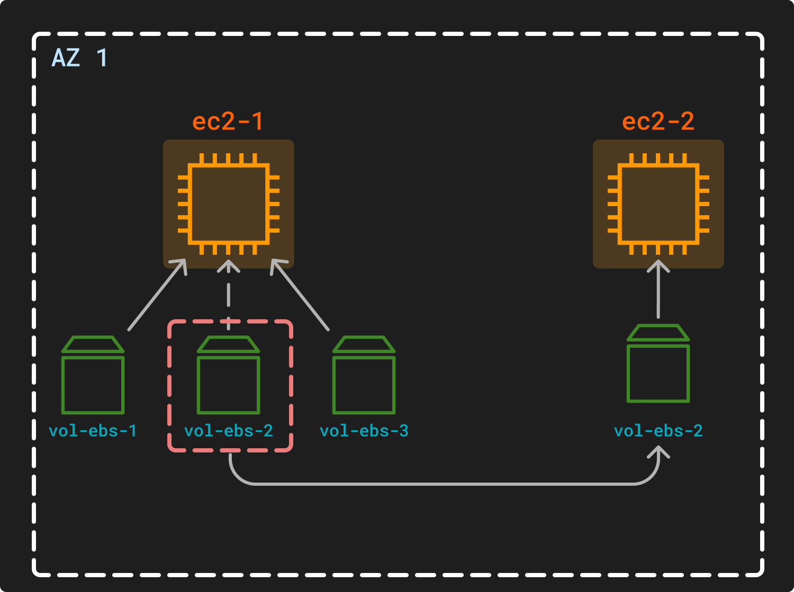
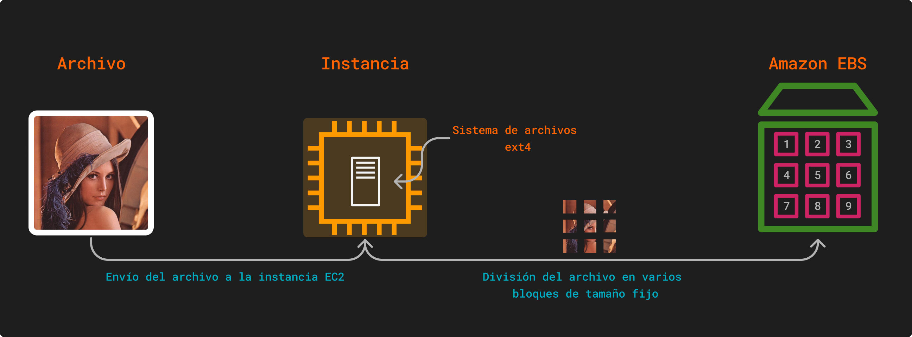
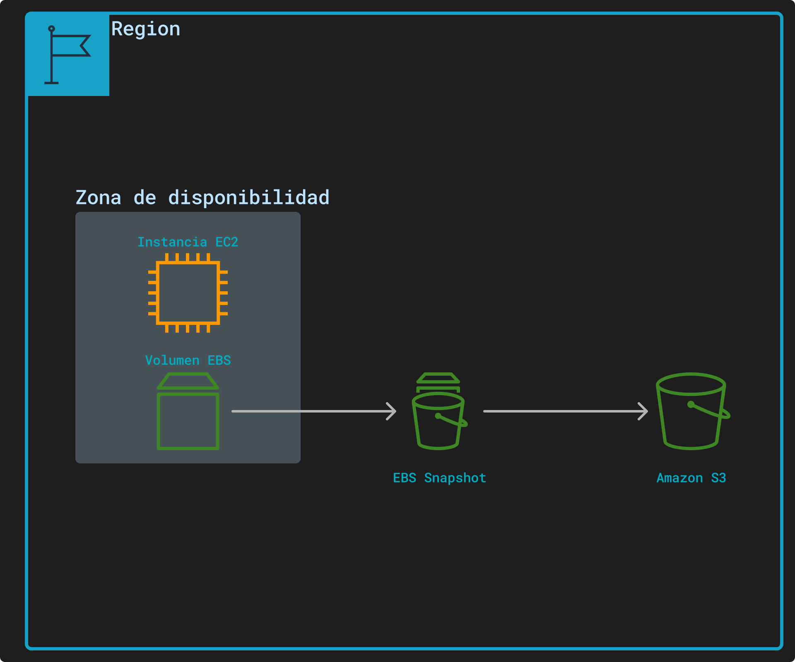
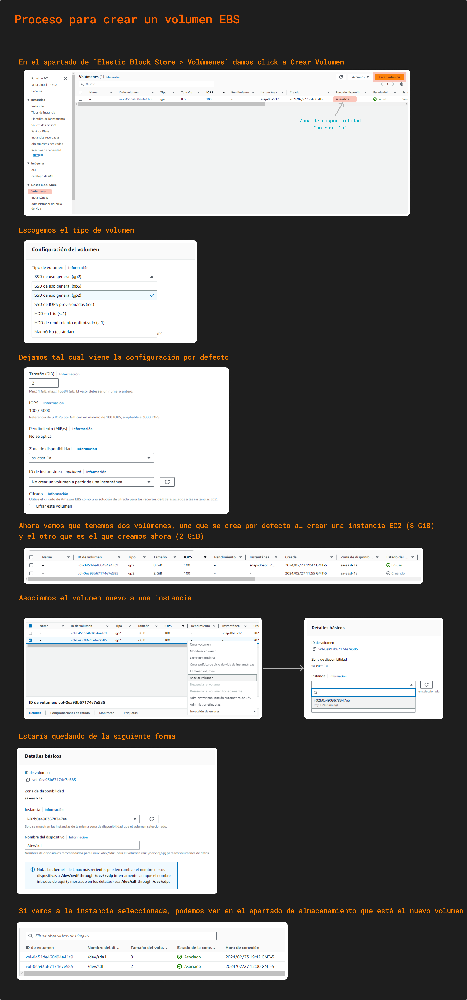
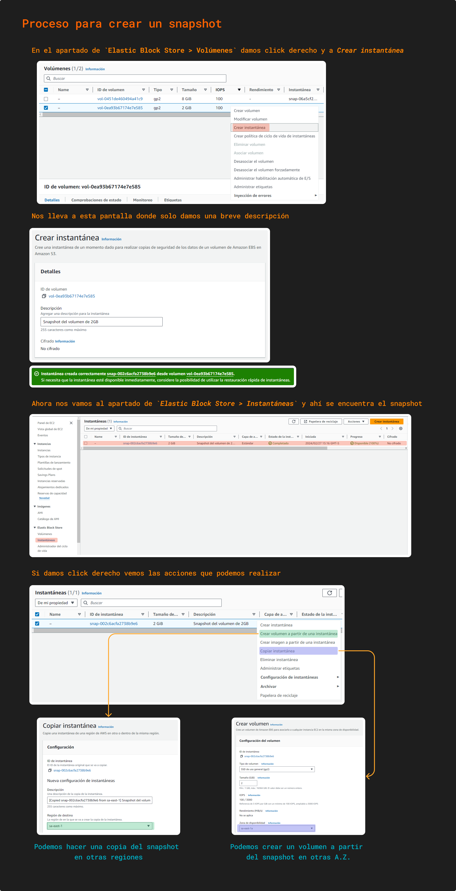

# ELASTIC BLOCK STORE (EBS)

Es una unidad de red que nos permite persistir data en instancias EC2 los volúmenes de almacenamiento son de [nivel de bloque](../definiciones/tipo-almacenamiento.md). Los volúmenes de EBS que están asociados a una instancia son independiente de la duración de la instancia.

EBS no es un almacenamiento físico, sino una unidad de red o un servicio de almacenamiento que permite crear y adjundar volúmenes de almacenamiento a instancias [EC2](../SECCION%202/ec2.md). Estos volúmenes actuan como discos virtuales que pueden ser formateados y utilizado como cualquier otro disco.

> Un EBS no es directamente un SSD o HDD, sino que una abstracción de la infraestructura de AWS en que se utiliza  SSD o HDD.

Varios volúmenes EBS pueden "estar dentro" de un hardware físico y pueden ser de diferentes usuarios o empresas.

Como Amazon EBS es algo abstracto, este tipo de almacenamiento puede ser montable y desmontable a las instancias EC2 de forma rápida, siempre y cuando pertenezcan a la misma [zona de disponibilidad](../definiciones/zona-disp.md).

El funcionamiento de Amazon EBS sería como se muestra en la figura siguiente

Un archivo, en este caso una imagen, se sube a nuestro servidor web que en este caso sería nuestra instancia EC2, dentro de ella está el sistema de archivos que sería el encargado de dividir en bloques de tamaño fijo, estos bloques son almacenador dentro de un volumen de EBS.

El tamaño fijo de cada bloque es definida por el tipo de disco que se implementa en Amazon EBS y ese mismo tamaño se aplica a todos los archivos que se desea almacenar.

## Snapshot

Amazon EBS ofrece la posibilidad de crear instantáneas (copias de seguridad) de cualquier volumen EBS y guardar una copia de los datos del volumen en Amazon S3. Una vez creada la primera instantánea, las siguientes son de forma progresiva, es decir, que solo se agrega los datos nuevos o modificados respecto a la anterior instantánea.

## Tipos de Volumenes de Amazon EBS

### SSD

Los volumenes basado en este tipo de unidad están optimizados para carga de trabajo de transacciones que impliquen operaciones de lectura/escritura frecuentes de pequeños tamaños de E/S, el atributo que resalta es **IOPS**.

Hay dos tipos de uso, **SSD para uso general** y **Provisioned IOPS SSD**.

||SSD para uso general|Provisioned IOPS SSD|
|---|---|---|
|Tipo de volumen|gp3, gp2|io2, io1 |
|Casos de uso|- Cargas de trabajo transaccionales   - Base de datos de tamaño mediano y una sola instancia   - Volumenes de arranque   - Aplicaciones interactivas de baja latencia|- Rendimiento de IOPS sostenido   -Cargas de trabajo de BD con uso intensivo de operaciones de E/S|
|Tamaño del volumen| 1 GB - 16 TB|4 GB - 16 TB|
|IOPS máximo|16000|256000 - 64000|

### HDD

Estos tipos de volumenes están optimizados para grandes cargas de trabajo de streaming, el atributo que resalta es el **rendimiento**.
Los tipos de volumen HDD incluyen **HDD de rendimiento optimizado** y **HDD en frío**

||Rendimiento optimizado|HDD en frío|
|---|---|---|
||st1|sc1|
|Caso de uso|- Big Data   - Data Warehouse   - Procesamiento de registros|- Para datos que se acceden con poca frecuencia   - Cuando se busque que el coste de almacenamiento sea bajo|
|Tamaño del volumen|125 GB - 16 TB|125 GB - 16 TB|
|IOPS máximo|500|250|

Amazon EBS es recomendable cuando los datos deben estar accesibles rápidamente y se necesita una persistencia a largo plazo.

>[!NOTE]
En EBS no se almacena gran cantidad de metadatos, ya que se basa en almacenamiento en bloques, donde sí se almacena información de metadatos es en los almacenamientos en objetos, Amazon S3.

## Procedimiento para crear un volumen en Amazon EBS

## Procedimiento para crear Snapshot

