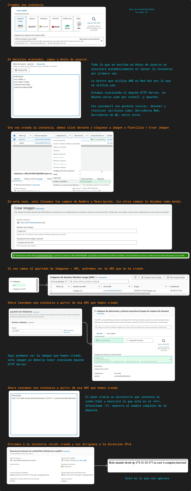

# Instancias y AMI

Amazon Machine Image (AMI) son utilizadas para crear máquinas virtuales dentro de AWS, esta plantilla contiene toda la información necesaria para lanzar una instancia EC2 tales como: sistema operativo, software de aplicación, configuraciones de red y datos relacionados; es la imagen con que se crea las máquinas virtuales como en VirtualBox o VMware. Además, indicaremos las demás características como CPU, memoria, almacenamiento, red, grupo de seguridad, entre otros ([tipo de instancia](../definiciones/tipo-instancia.md)) para tener nuestra máquina virtual completa.

Cuando se lanza una instancia, se crea un **volumén raíz** para dicha instancia. Este contiene la imagen que se usa para arrancar dicha instancia. Hay dos tipos de volumen raíz, uno es `ebs` (respaldada por [Amazon EBS](../SECCION%203/ebs.md)) y otra `instance store` (respaldo por almacen de instancias). El **EBS raíz** tiene la características de ser un almacenamiento persistente, es decir, aún cuando la instancia se detenga, lo que está en el volumen no se pierde y es más rápido el tiempo de arranque, solo se elimina cuando se da *terminar instancia*. El **Instance Store** los datos en cualquier volumen de instancia se conserva solo durante el ciclo de vida de la instancia y el tiempo de arranque es menor a 5 min.

## Creación de una AMI

La creación de una AMI nos permite iniciar otras instancias a partir de este AMI que tenga todo lo que no nosotros hayamos establecido en el inicio. 
En la imagen siguiente, muestra la creación de una instancia inicial en el que se instala **Apache HTTP Server**, que es un [servidor web](servidor-web.md), esto al inicio toma un tiempo mayor ya que se demora en la descarga e instalación. Luego se crea una AMI a partir de esa instancia por lo que ya tendría el Apache HTTP Server ya instalado, finalmente se crea una instancia nueva a partir de la AMI creada por nosotros y el tiempo de demora del lanzamiento es menor.

