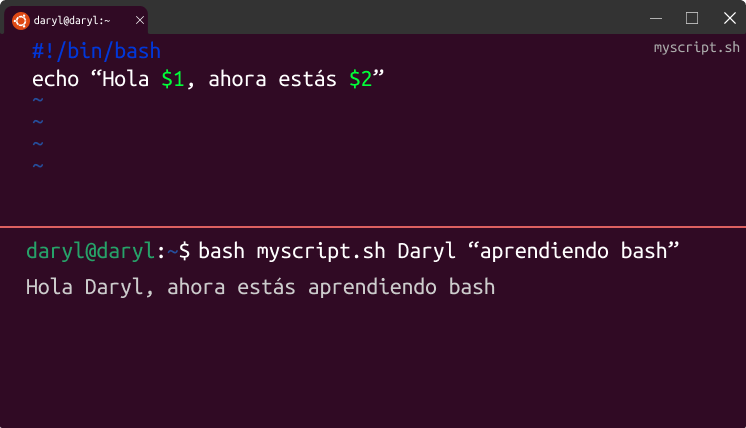
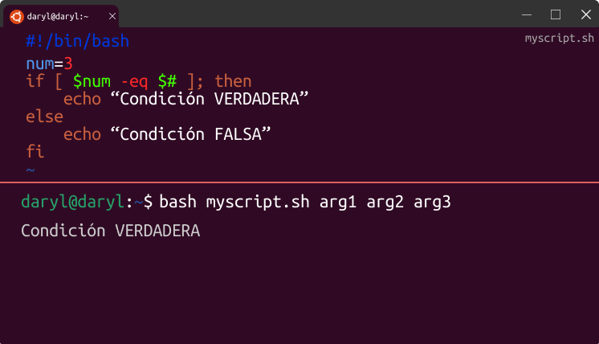
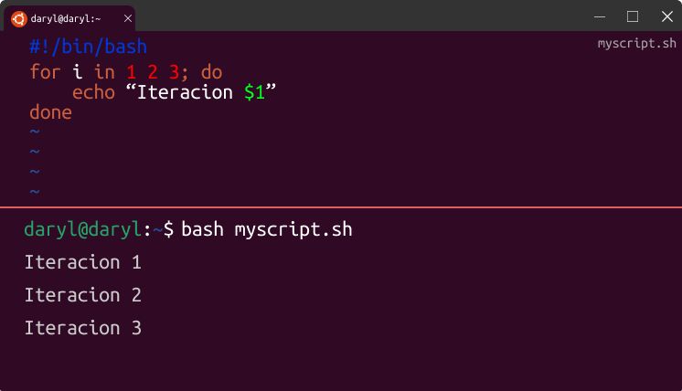
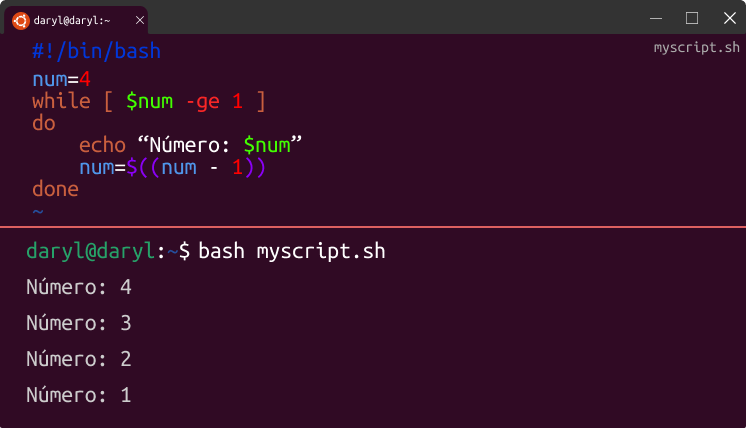
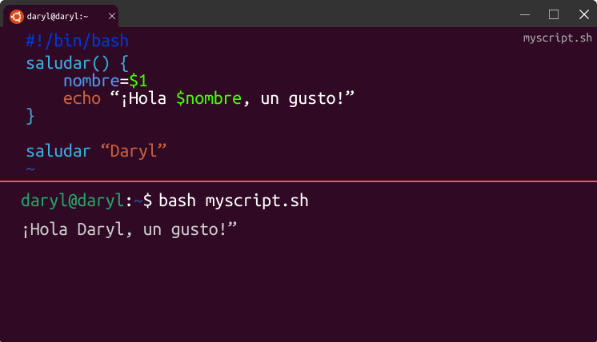

# Fundamentos de Bash

Bourne Again Shell (Bash) es un interprete de comandos (shell) para sistemas operativos tipo Unix. Bash proporciona un interfaz de línea de comandos para interactuar con el sistema operativo. Permite ejecutar comandos, scripts y programas así como automatizar tareas mediante secuencias de comandos (scripts).

Bash ofrece características avanzadas como variables, bucles, condicionales, funciones entre otras, lo que lo hace muy poderoso y flexible.

`#!/bin/bash`: Es también conocido como **shebang (#!)** e indica que el archivo es un script que debe ser interpretado por Bash

`bash nombre-script.bash`: De esta forma podemos ejecutar el script

## Argumentos

Podemos colocar argumentos en el script de bash mediante `$1`, esto significa que es el primer argumento, para el segundo sería `$2`, tercero `$3` y así. Luego estos los valores de estos argumentos serán escritos al momento de ejecutar el script

```bash title="myscript.bash"
#!/bin/bash
echo "Hola $1, ahora estás $2"
```
Ejecutamos con lo siguiente

`bash myscript.bash Daryl "aprendiendo bash"`

Output:

`Hola Daryl, ahora estás aprendiendo bash`


## Variables
Para usar una variable se debe colocar primero el símbolo del dolar `$`

**Variables especiales**

|Variable especial|Significado|
|---|---|
|$@|Almacena los argumentos como si fueran un array|
|$$|Muestra el ID del proceso (PID) de la shell actual|
|$#|Muestra la cantidad de argumentos proporcionados|
|$*|Agrupa todos los argumentos|
|$0|Muestra el nombre del archivo actual|
|$_|Asigna la variable al último argumento del último comando|
|$!|Muestra el ID del último trabajo (PID) en segundo plano|
|$?|Muestra el código de estado de salida para el último comando ejecutado|
|$-|Muestra las opciones de configuración del shell actual|

>[!NOTE]
La diferencia entre `$@` y `$\*` es en el uso para argumentos compuestos, si se coloca entre comillas `"` su comportamiento cambia, en el caso de `"$@"` respeta los argumentos que tienen espacios y solo separa con los demás argumentos. Por otro lado, `"$*"` une todos los argumentos como si estuviera concatenando.

>[!IMPORTANT]
No olvidar que la asignación de un valor no debe haber espacio con el símbolo `=`

**Comparación Numérica**
|Operador|Significado|
|---|---|
|-eq|igual que|
|-ne|no igual que|
|-lt|menor que|
|-le|menor o igual que|
|-gt|mayor que|
|-ge|mayor igual que|

**Comparación de Cadenas**
|Operador|Significado|
|---|---|
|=|Igualdad|
|!=|Diferencia|
|<|Menor que (en orden lexicográfico)|
|>|Mayor que (en orden lexicográfico)|
|-z|Cadena vacía|
|-n|Cadena no vacía|

**Comprobación de Archivos**
|Operador|Significado|
|---|---|
|-f|True si el archivo existe y es regular|
|-d|True su ek archivo existe y es un directorio|
|-e|True si el archivo existe|
|-s|True si el archivo existe y no está vacío|

## Condición If

La sintáxis para la condición es la siguiente

```bash
if [ condición ];then
    # bloque de código, si la condición es verdadera
else
    # bloque de código, si la condición es falsa
fi
```
>[!NOTE]
Es necesario que se coloque un espacio entre la condición y los corchetes `[ condition ]` y debe haber un espacio entre los operadores de condición `[ $num -eq 4]`




## BUCLES
### For
La sintáxis es la siguiente

```bash
for i in range; do
    #code block
done
```

### While
La sintáxis es la siguiente

```bash
while [ condición ]
do
    #code block
done
```
>[!IMPORTANT]
Para evaluar expresiones de condición se utiliza `[ ... ]` y para las aritméticas debe ser dentro de `( ... )`



## Funciones
La sintáxis es la siguiente

```
nombre-funcion() {
    #code block
}
```
