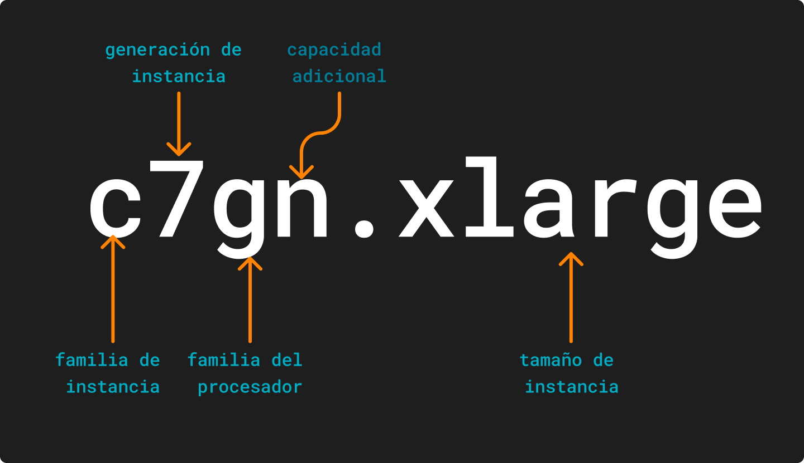

# Tipos de instancias

Al crear una instancia tendrá que indicar el *tipo de instancia* que utilizará, este agrupa distintas características computacional, tales como: memoria, almacenamiento, CPU, entre otras.

## Nomenclatura

Los nombres de los tipos de instancias se basan en su familia, generación, familia de procesadores, capacidades adicionales y tamaño.

**Familia de Instancias**: En la siguiente tabla se muestra las instancias con un uso más común.
|Abreviatura|Significado|
|---|---|
|C|Optimizada para la computación|
|M|Uso general|
|P|GPU acelerada|
|I|Optimizada pra el almacenamiento|
|R|Optimizada para la memoria|
|U|Memoria elevada|
|X|Uso intensivo de la memoria|
|D|Almacenamiento denso|
|G|Uso intensivo de gráficos|
|T|Rendimiento ampliable|
|Hpc|Computación de alto rendimiento|
|F|FPGA|

**Familia de procesadores**
|Abreviatura|Significado|
|---|---|
|a|procesadores AMD|
|g|procesadores AWS Graviton|
|i|procesadores Intel|

**Capacidad adicional**
|Abreviatura|Significado|
|---|---|
|b|Optimizado para EBS|
|d|Volúmenes de almacén de instancia|
|n|Optimizado para redes y EBS|
|e|Almacenamiento o memoria adicionales|
|z|Alto rendimiento|
|q|Aceleradores de inferencia de Qualcomm|
|flex|Instancia flexible|
